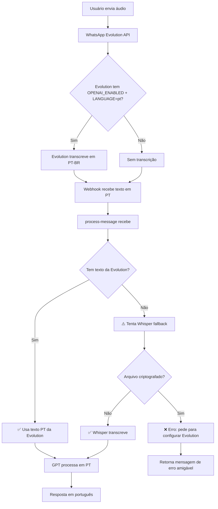

# 🎯 Solução Final - Transcrição de Áudio em Português

## 📋 Problema Identificado

Após extensa investigação, identificamos **2 problemas**:

### 1. **Evolution API configurada em inglês**
```env
LANGUAGE=en  ❌ ERRADO
```

### 2. **Arquivos de áudio do WhatsApp são criptografados**
- URL: `https://mmg.whatsapp.net/.../file.enc`
- Whisper não consegue processar arquivos `.enc`
- Erro: `Invalid file format`

---

## ✅ Solução Implementada

### **Abordagem Híbrida:**
1. ✅ **Primário**: Usa transcrição da Evolution API (configurada para PT-BR)
2. ✅ **Fallback**: Tenta Whisper se Evolution não enviar transcrição
3. ✅ **Error Handling**: Mensagens amigáveis para o usuário

---

## 🚀 Passos para Implementar

### **Passo 1: Configurar Evolution API (CRÍTICO!)**

No **Easypanel**, altere a variável de ambiente:

**ANTES:**
```env
LANGUAGE=en
```

**DEPOIS:**
```env
LANGUAGE=pt
```

**Depois:** Reinicie o container da Evolution API.

---

### **Passo 2: Verificar Outras Configurações da Evolution**

Certifique-se de que estão configuradas:
```env
OPENAI_ENABLED=true  ✅ (você já tem)
LANGUAGE=pt          ✅ (você vai configurar agora)
```

---

### **Passo 3: Deploy das Edge Functions**

Acesse o Dashboard do Supabase e faça deploy manual:

#### **3.1 Deploy process-message**
1. Vá para: https://supabase.com/dashboard/project/bvjfiismidgzmdmrotee/functions/process-message
2. Clique em "Edit function"
3. Copie **TODO** o conteúdo de: `supabase/functions/process-message/index.ts`
4. Cole no editor
5. Clique em "Deploy"

#### **3.2 Deploy whatsapp-webhook**
1. Vá para: https://supabase.com/dashboard/project/bvjfiismidgzmdmrotee/functions/whatsapp-webhook
2. Clique em "Edit function"
3. Copie **TODO** o conteúdo de: `supabase/functions/whatsapp-webhook/index.ts`
4. Cole no editor
5. Clique em "Deploy"

---

### **Passo 4: Testar**

Envie áudio via WhatsApp:
- 🎙️ Fale claramente por ~5 segundos: *"Me lembra de comprar leite amanhã às dez horas"*
- ✅ Deve receber resposta em português

---

## 📊 Monitoramento

### **Logs para Verificar**

Acesse: https://supabase.com/dashboard/project/bvjfiismidgzmdmrotee/logs/edge-functions

**No `whatsapp-webhook`:**
```
🎙️ Audio message received
✅ Evolution speechToText found: [texto em português]  ← DEVE APARECER!
📤 Sending to backend: { hasEvolutionText: true, ... }
```

**No `process-message`:**
```
📝 Initial content received: [texto em português]  ← DEVE TER TEXTO!
✅ Using Evolution API transcription (PT-BR): [texto]
⏭️ Skipping Whisper - already have transcription from Evolution
```

---

## 🔍 Troubleshooting

### ❌ **Problema: Evolution ainda envia transcrição em inglês**

**Sintoma nos logs:**
```
✅ Evolution speechToText found: Buy milk tomorrow
```

**Solução:**
1. Verifique se mudou `LANGUAGE=pt` na Evolution
2. Reinicie o container Evolution
3. Teste novamente

---

### ❌ **Problema: Evolution não envia speechToText**

**Sintoma nos logs:**
```
⚠️ No speechToText from Evolution - Whisper will attempt fallback
```

**Solução:**
1. Verifique `OPENAI_ENABLED=true` na Evolution
2. Verifique se a Evolution tem créditos/API key da OpenAI configurada
3. Reinicie o container Evolution

---

### ❌ **Problema: Whisper tenta e falha com "Invalid file format"**

**Sintoma nos logs:**
```
❌ Whisper Error: Invalid file format
🔒 File is encrypted - cannot transcribe
```

**Solução:**
- Isso é **esperado** se Evolution não enviar transcrição
- Configure Evolution corretamente (ver acima)
- Evolution API descriptografa automaticamente e transcreve

---

## ✅ Checklist Final

Antes de testar:

- [ ] Mudei `LANGUAGE=pt` na Evolution API (Easypanel)
- [ ] Reiniciei container da Evolution API
- [ ] Verifiquei `OPENAI_ENABLED=true` na Evolution
- [ ] Fiz deploy de `process-message`
- [ ] Fiz deploy de `whatsapp-webhook`
- [ ] Enviei áudio de teste (~5 segundos em português)
- [ ] Verifiquei logs e confirmei transcrição em PT
- [ ] Recebi resposta correta do assistente em PT

---

## 🎯 Como Funciona Agora



---

## 📝 Notas Técnicas

### **Por que Evolution + Whisper?**
- **Evolution**: Descriptografa áudio automaticamente (arquivos `.enc`)
- **Whisper**: Só funciona com arquivos descriptografados
- **Solução**: Evolution faz transcrição direta via OpenAI Whisper DELA

### **Por que manter Whisper no código?**
- **Fallback**: Se Evolution falhar ou não tiver OpenAI configurada
- **Redundância**: Segurança extra
- **Flexibilidade**: Permite testes locais

---

## 📞 Próximos Passos

1. **Configure Evolution** (`LANGUAGE=pt` + restart)
2. **Deploy das funções**
3. **Teste com áudio**
4. **Me avise o resultado!** 🚀

---

**Boa sorte!** Se precisar de ajuda durante o processo, me avise! 📱✅
